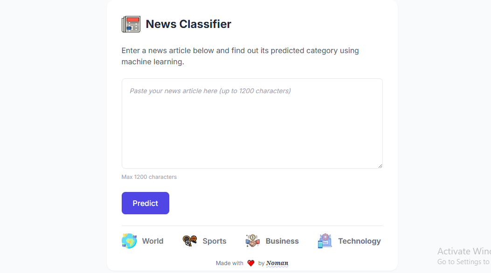

<section id="project-title">
  <h1>News Classification with Flask</h1>
  
<em>A machine learning-powered Flask app to classify news articles into categories like World, Sports, Business, and Technology.</em>

</section>

  

<section id="overview">
  <h2>Overview</h2>
  
This project is a web application built using Flask that classifies news articles into predefined categories using a trained logistic regression model combined with text preprocessing and TF-IDF vectorization.

  
  <h3>Problem it Solves</h3>
  
With the overwhelming amount of news published daily, this application helps automatically categorize news articles, enabling better content organization, filtering, and personalized news delivery.

  
  <h3>Technologies Used</h3>
  <ul>
    <li>Python 3.11+</li>
    <li>Flask</li>
    <li>Scikit-learn (Logistic Regression, TF-IDF Vectorizer)</li>
    <li>NLTK (Natural Language Toolkit) for text preprocessing</li>
    <li>Joblib for model serialization</li>
    <li>Render.com for deployment</li>
  </ul>
</section>

<section id="installation">
  <h2>Installation</h2>
  
Follow these steps to get the project up and running locally:

  <ol>
    <li>Clone the repository:
      <pre><code>git clone https://github.com/your-username/your-repo.git</code></pre>
    </li>
    <li>Navigate into the project directory:
      <pre><code>cd your-repo</code></pre>
    </li>
    <li>Create and activate a Python virtual environment:
      <pre><code>python -m venv venv
source venv/bin/activate  <em>(Linux/Mac)</em>
venv\Scripts\activate     <em>(Windows)</em></code></pre>
    </li>
    <li>Install dependencies:
      <pre><code>pip install -r requirements.txt</code></pre>
    </li>
    <li>Download NLTK data:
      <pre><code>python -m nltk.downloader punkt stopwords wordnet omw-1.4</code></pre>
    </li>
    <li>Run the Flask app:
      <pre><code>python app.py</code></pre>
    </li>
  </ol>
</section>

<section id="usage">
  <h2>Usage</h2>
  
Once the app is running, open your browser and navigate to <a href="http://localhost:5000" target="_blank" rel="noopener noreferrer">http://localhost:5000</a>.

  
Paste a news article in the input box and click the “Classify” button to get the predicted category along with the confidence score.

  
The app performs basic validation to ensure the input is article-length and attempts to classify the text with a reasonable confidence threshold.

</section>

<section id="deployment">
  <h2>Deployment</h2>
  
This project is deployed using <a href="https://render.com" target="_blank" rel="noopener noreferrer">Render</a>. Below are the key points for deployment:

  <ul>
    <li>The application uses <code>gunicorn</code> as the production WSGI server, specified in the <code>Procfile</code>.</li>
    <li>Python dependencies are managed through <code>requirements.txt</code> and installed during the build process.</li>
    <li>NLTK data packages are downloaded during the build phase via a custom <code>build.sh</code> script to reduce app startup time.</li>
    <li>The app listens on the port specified by the environment variable <code>PORT</code> to comply with Render's requirements.</li>
    <li>Environment variables, such as <code>NLTK_DATA</code>, are configured through Render’s dashboard to ensure correct data path usage.</li>
  </ul>
  
For more details and troubleshooting, see the <a href="https://render.com/docs/troubleshooting-deploys" target="_blank" rel="noopener noreferrer">Render deployment docs</a>.

</section>

<section id="project-structure">
  <h2>Project Structure</h2>
  <pre><code>
01_news_classification/
├── data/
│   └── train.csv               # Training data CSV file
├── models/
│   └── news_classifier_pipeline.pkl   # Saved sklearn pipeline model
├── static/
│   ├── css/                   # Stylesheets
│   ├── img/                   # Images
│   └── js/                    # JavaScript files
├── templates/
│   └── index.html             # Main HTML template
├── app.py                     # Flask application entry point
├── build.sh                   # Custom build script for deployment
├── model_train.py             # Script to train and save the model
├── Procfile                   # Specifies gunicorn command for deployment
├── requirements.txt           # Python dependencies
├── runtime.txt                # Python runtime version
└── text_preprocessor.py       # Custom sklearn transformer for text preprocessing
  </code></pre>
</section>

<section id="contributing">
  <h2>Contributing</h2>
  
Contributions to this project are welcome! If you'd like to help improve the code, please follow these steps:

  <ol>
    <li>Fork the repository on GitHub.</li>
    <li>Create a new branch for your feature or bug fix.</li>
    <li>Make your changes and test thoroughly.</li>
    <li>Submit a pull request with a clear description of your changes.</li>
  </ol>
  
Please ensure your code adheres to the existing style and passes all tests before submitting.

</section>

<section id="license">
  <h2>License</h2>
  
This project is licensed under the <a href="https://opensource.org/licenses/MIT" target="_blank" rel="noopener noreferrer">MIT License</a>. You are free to use, modify, and distribute the code as per the terms of this license.

</section>
